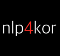

# nlp4kor
- Natural Language Processing for Korean with Deep Learning
- 딥러닝을 이용한 한글 자연어 처리
- 발표자료는 발표(행아웃) 후 공개되며, 동영상은 다음 발표할 때 공개됩니다.
- 발표자료/동영상에 대한 오류 수정 및 피드백은 bage79@gmail.com로 주시면 최대한 반영하겠습니다.

## Season #1 2017.05 ~ 2017.07 (FFNN, CNN, word2vec)

### 1. MNIST 예제 뜯어 보기 (Tensorflow 기초) - 박혜웅, 2017.05.20
- https://github.com/bage79/nlp4kor/blob/master/ipynb/MNIST_2_cnn.ipynb 
- http://nbviewer.jupyter.org/github/bage79/nlp4kor/blob/master/ipynb/MNIST_2_cnn.ipynb
-  
